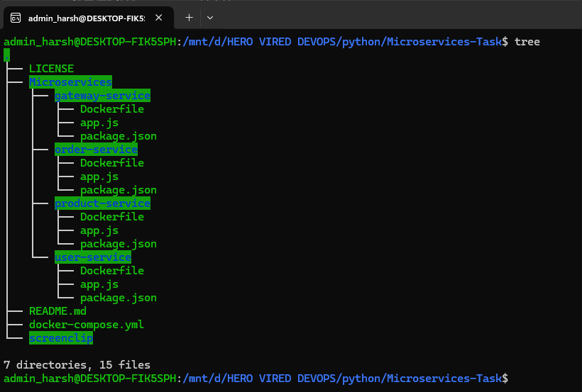
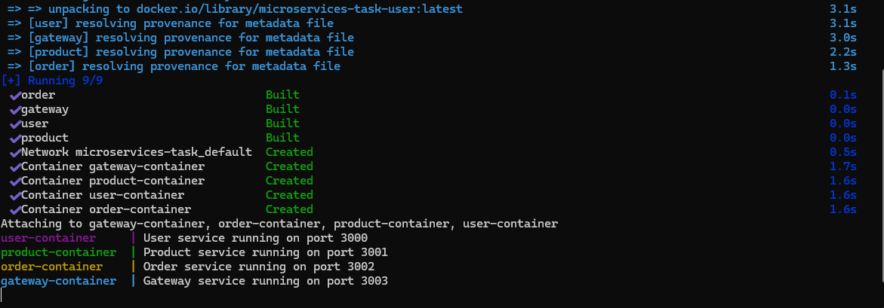
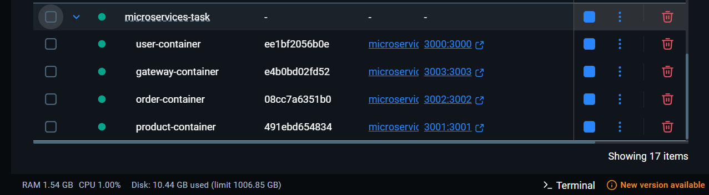
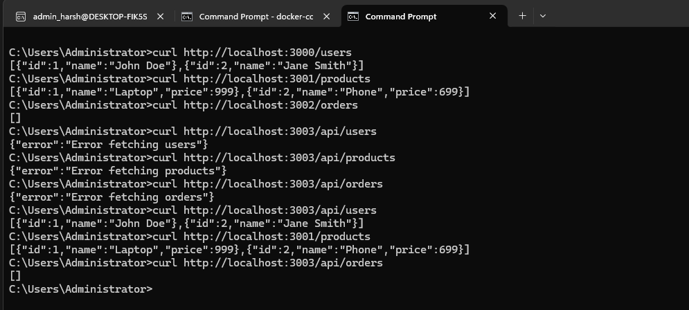

# Microservices-Task

## Overview
This document provides details on testing various services after running the `docker-compose` file. These services include User, Product, Order, and Gateway Services. Each service has its own endpoints for testing purposes.

---

## Services and Endpoints

### **User Service**
- **Base URL:** `http://localhost:3000`
- **Endpoints:**
  - **List Users:**  
    ```
    curl http://localhost:3000/users
    ```
    Or open in your browser: [http://localhost:3000/users](http://localhost:3000/users)

---

### **Product Service**
- **Base URL:** `http://localhost:3001`
- **Endpoints:**
  - **List Products:**  
    ```
    curl http://localhost:3001/products
    ```
    Or open in your browser: [http://localhost:3001/products](http://localhost:3001/products)

---

### **Order Service**
- **Base URL:** `http://localhost:3002`
- **Endpoints:**
  - **List Orders:**  
    ```
    curl http://localhost:3002/orders
    ```
    Or open in your browser: [http://localhost:3002/orders](http://localhost:3002/orders)

---

### **Gateway Service**
- **Base URL:** `http://localhost:3003/api`
- **Endpoints:**
  - **Users:**  
    ```
    curl http://localhost:3003/api/users
    ```
  - **Products:**  
    ```
    curl http://localhost:3003/api/products
    ```
  - **Orders:**  
    ```
    curl http://localhost:3003/api/orders
    ```

---

## Instructions
1. Start all services using the `docker-compose` file:
   ```
   docker-compose up
   ```
2. Once the services are running, use the above endpoints to verify the functionality.

Happy testing!

# Containerize micorservices
We need complete all task for setup all four microservices 

- [x] Create docker file for each microservice
- [x] Create docker compose configuration to define all four microservices
- [x] Build and run docker images
- [x] Test all endpoints

## Create docker file for each microservice
Create `Dockerfile` file in every microservice directory

- File structure  
  

- `Dockerfile` for user service
  ```
  FROM node:22
  WORKDIR /app
  COPY . .
  RUN npm install
  EXPOSE 3000
  CMD [ "node","app.js" ]
  ```
- `Dockerfile` for product service
  ```
  FROM node:22
  WORKDIR /app
  COPY . .
  RUN npm install
  EXPOSE 3001
  CMD [ "node","app.js" ]
  ```
- `Dockerfile` for order service
  ```
  FROM node:22
  WORKDIR /app
  COPY . .
  RUN npm install
  EXPOSE 3002
  CMD [ "node","app.js" ]
  ```
- `Dockerfile` for gateway service
  ```
  FROM node:22
  WORKDIR /app
  COPY . .
  RUN npm install
  EXPOSE 3003
  CMD [ "node","app.js" ]
  ```

## Create docker compose configuration to define all four microservices
Create `docker-compose.yml` file in root directory in which all microservices directory are (`Microservices`)

```
version: '3.9'

services:
  user-service:
    build: ./Microservices/user-service
    container_name: user-container
    ports:
      - "3000:3000"

  product-service:
    build: ./Microservices/product-service
    container_name: product-container
    ports:
      - "3001:3001"

  order-service:
    build: ./Microservices/order-service
    container_name: order-container
    ports:
      - "3002:3002"

  gateway-service:
    build: ./Microservices/gateway-service
    container_name: gateway-container
    ports:
      - "3003:3003"

```
## Build and run docker images
On Windows with Docker Engine
-  This command find `.yml` file in current directory and start build images and run container
  ```
  docker-compose up
  ```
- Build images   
  
- Running Container in Docker engine   
  

## Test all endpoints
Check all enpoint using `curl` and fixed gateway-service issue
-  


